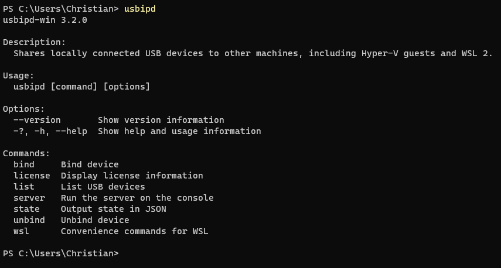
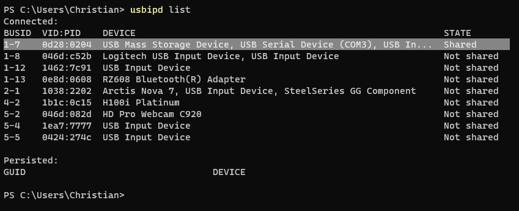
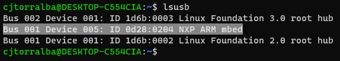

### Getting the MicroBit to work on Windows

Prerequisites:
- Windows 11
- Minimum WSL version of `5.10.60.1`

We will using `usbipd` 

#### Installation:
- `winget install --interactive --exact dorssel.usbipd-win`

On the WSL side we will run
- `sudo apt install linux-tools-generic hwdata`

  `sudo update-alternatives --install /usr/local/bin/usbip usbip /usr/lib/linux-tools/*-generic/usbip 20`

To test it out run `usbipd` you should see something like this:

#### Working with the MicroBit

First, list devices using `usbip --list` It should look something like this:

See which `busid` your microbit is connected to, mine was listed as `1-7    0d28:0204  USB Mass Storage Device, USB Serial Device (COM3), USB In...`

Using that, now run `usbipd wsl attach --busid <busid>`

For reference, this is the command I ran: `usbipd wsl attach --busid 1-7`

Now go over to your WSL client and run `lsusb`, if your MicroBit is showing up, you did everything correctly!

My device was labeled as `Bus 001 Device 006: ID 0d28:0204 NXP ARM mbed`

#### Errors:

If you are running into any errors, first ensure that your wsl client is upto date. 

If the issue continues, ensure that there are no processes using the MicroBit.

If issues continue, restart PC and try again.

I also used these guides to troubleshoot when I ran into any problems:
- [Failed to attach device](https://github.com/dorssel/usbipd-win/issues/245)
- [Attach request failed](https://unix.stackexchange.com/questions/699877/usbip-error-attach-request-for-busid-failed-device-busy-exported)
- [USBIPD not found for kernel](https://askubuntu.com/questions/1384456/usbipd-not-found-for-kernel-when-using-usb-ip-with-wsl)

#### Microsoft guide
You can also follow [this](https://learn.microsoft.com/en-us/windows/wsl/connect-usb) guide for more information if this
approach did not work for you.